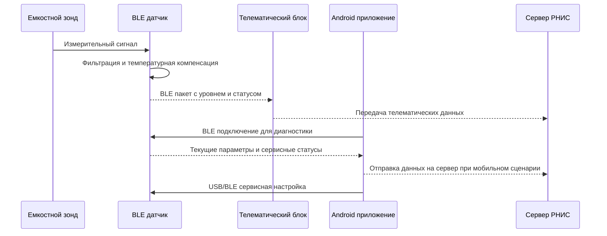

# Диаграмма взаимодействия

```mermaid
sequenceDiagram
    participant Probe as Емкостной зонд
    participant Sensor as BLE датчик
    participant TBox as Телематический блок
    participant App as Android приложение
    participant RNIS as Сервер РНИС

    Probe->>Sensor: Измерительный сигнал
    Sensor->>Sensor: Фильтрация и температурная компенсация
    Sensor-->>TBox: BLE пакет с уровнем и статусом
    TBox-->>RNIS: Передача телематических данных
    App->>Sensor: BLE подключение для диагностики
    Sensor-->>App: Текущие параметры и сервисные статусы
    App-->>RNIS: Отправка данных на сервер при мобильном сценарии
    App->>Sensor: USB/BLE сервисная настройка
```
